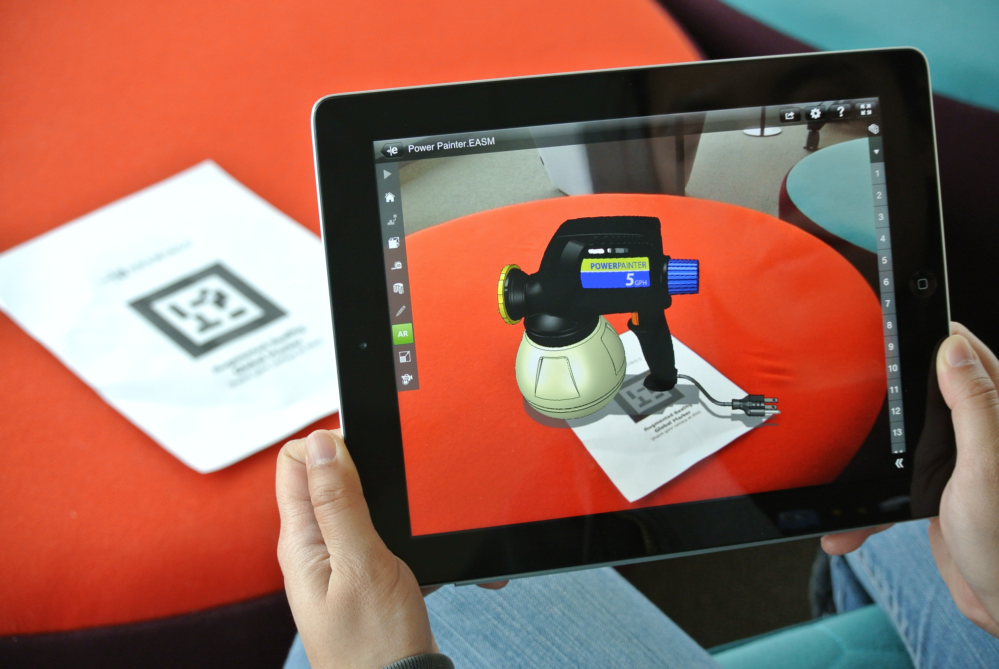

<!--++++++++++++ SLIDE ++++++++++++-->
<!-- .slide: data-background="./img/img01[businesswire.com].jpg" -->
# Realidade mista e cultura 3D

Carlos Eduardo (Cadu) Elmadjian

Andrew (Toshi) Kurauchi

José Antonio Tula Leyva

latin.ime.usp.br <!-- .element: class="smaller" -->

---

<!--++++++++++++ SLIDE ++++++++++++-->
## This talk is about...
<!-- .element: class="fragment"--> 
<!-- .element: class="fragment"--> 

---

<!--++++++++++++ SLIDE ++++++++++++-->
<!-- .slide: data-transition="slide-in none" -->
##### <!-- .element: class="header" -->Introduction
## First things first

* <!-- .element: class="fragment" data-fragment-index="1"-->Point-of-Gaze (PoG)
* <!-- .element: style="visibility:hidden;"-->

<!-- .element: class="imgright fragment" data-fragment-index="1" -->

SOURCE: Elias D. Guestrin

---

<!-- .slide: data-transition="none"-->
##### <!-- .element: class="header" -->Introduction
## First things first
* Point-of-Gaze (PoG)
* real-time input

<!-- .element: class="imgright"-->

SOURCE: Human Benchmark Project

---

<!--++++++++++++ SLIDE ++++++++++++-->
##### <!-- .element: class="header" -->Introduction
## What it is **not**...
* <!-- .element: class="fragment"-->a mouse replacement
* <!-- .element: class="fragment"-->an accessibility technique only
* <!-- .element: class="fragment"-->a redundant technique
* <!-- .element: class="fragment"-->eye tracking

---

<!--++++++++++++ SLIDE ++++++++++++-->
##### <!-- .element: class="header" -->Introduction
## So, gaze interaction is...
1. <!-- .element: class="fragment"-->use of real-time PoG for HCI (_Tobii_)
2. <!-- .element: class="fragment"-->use of gaze in a convenient and natural way (_Jacob_)
3. <!-- .element: class="fragment"-->use of visual attention for better UX (_SMI_)

---

<!--++++++++++++ SLIDE ++++++++++++-->
<!-- .slide: data-transition="slide-in fade-out" -->
<!-- .slide: data-background-image="./img/img03[pitlab.itu.dk].jpg"-->
## What characterizes gaze interaction?

SOURCE: pitlab.itu.dk

---

<!--++++++++++++ SLIDE ++++++++++++-->
<!-- .slide: data-transition="fade-in slide-out" -->
##### <!-- .element: class="header" -->Characteristics
## A glimpse of the past
* <!-- .element: class="fragment"-->present since the beginning of HCI (1980s)
* <!-- .element: class="fragment"-->exploratory / application studies (1990s and 2000s)
* <!-- .element: class="fragment"-->low-cost eye trackers (2010s)

---

<!--++++++++++++ SLIDE ++++++++++++-->
<!-- .slide: data-transition="slide-in none"-->
##### <!-- .element: class="header" -->Characteristics
## Typical issues
* <!-- .element: class="fragment" data-fragment-index="1"-->precision/noise
* <!-- .element: style="visibility:hidden;"-->

<!-- .element: class="fragment imgright" data-fragment-index="1"-->

SOURCE: Green Heart Education

---

<!-- .slide: data-transition="none"-->
##### <!-- .element: class="header" -->Characteristics
## Typical issues
* precision/noise
* accuracy

<!-- .element: class="imgleft" -->

SOURCE: mhhe.com

---

<!-- .slide: data-transition="none"-->
##### <!-- .element: class="header" -->Characteristics
## Typical issues
* precision/noise
* accuracy
* calibration
* <!-- .element: class="fragment" data-fragment-index="1"-->"Midas touch"

<!-- .element: class="fragment imgleft" data-fragment-index="1"-->

SOURCE: greek mythology wikia

---

<!-- .slide: data-transition="none"-->
##### <!-- .element: class="header" -->Characteristics
## Typical issues
* precision/noise
* accuracy
* calibration
* "Midas touch"
* entry barriers
* <!-- .element: class="fragment"-->ambiguous data

---

<!--++++++++++++ SLIDE ++++++++++++-->
<!-- .slide: data-transition="slide-in none"-->
##### <!-- .element: class="header" -->Characteristics
## Typical selection techniques
* <!-- .element: class="fragment" data-fragment-index="1"-->dwell-time selection
* <!-- .element: style="visibility:hidden;"-->

<!-- .element: class="fragment imgright" data-fragment-index="1"-->

SOURCE: Majaranta et al. (2003)

---

<!-- .slide: data-transition="none"-->
##### <!-- .element: class="header" -->Characteristics
## Typical selection techniques
* dwell-time selection
* context switching / reverse crossing

<!-- .element: class="imgleft"-->

SOURCE: Kurauchi et al. (2016)

---

<!-- .slide: data-transition="none"-->
##### <!-- .element: class="header" -->Characteristics
## Typical selection techniques
* dwell-time selection
* context switching / reverse crossing
* blinking

<!-- .element: class="imgright"-->

SOURCE: giphy.com

---

<!-- .slide: data-transition="none"-->
##### <!-- .element: class="header" -->Characteristics
## Typical selection techniques
* dwell-time selection
* context switching / reverse crossing
* blinking
* smooth pursuits

<!-- .element: class="imgright"-->

SOURCE: Esteves et al. (2015)

---

<!-- .slide: data-transition="none slide-out"-->
##### <!-- .element: class="header" -->Characteristics
## Typical selection techniques
* dwell-time selection
* context switching / reverse crossing
* blinking
* smooth pursuits
* multimodal

---

<!--++++++++++++ SLIDE ++++++++++++-->
<!-- .slide: data-transition="slide-in none"-->
##### <!-- .element: class="header" -->Characteristics
## Non-selection techniques
* <!-- .element: class="fragment" data-fragment-index="1"-->navigation
* <!-- .element: style="visibility:hidden;"-->

<!-- .element: class="fragment imgright" data-fragment-index="1"-->

SOURCE: giphy.com

---

<!-- .slide: data-transition="none"-->
##### <!-- .element: class="header" -->Characteristics
## Non-selection techniques
* navigation
* highlighting

<!-- .element: class="imgright"-->

SOURCE: giphy.com

---

<!-- .slide: data-transition="none"-->
##### <!-- .element: class="header" -->Characteristics
## Non-selection techniques
* navigation
* highlighting
* scrolling

<!-- .element: class="imgright"-->

SOURCE: giphy.com

---

<!-- .slide: data-transition="none slide-out"-->
##### <!-- .element: class="header" -->Characteristics
## Non-selection techniques
* navigation
* highlighting
* scrolling
* indirect cues

<!-- .element: class="imgright"-->

SOURCE: giphy.com / Disney-PIXAR

---

<!--++++++++++++ SLIDE ++++++++++++-->
<!-- .slide: data-background-color="#2e594f"-->
##### <!-- .element: class="header" -->Characteristics
## An unsettling remark

* <!-- .element: class="fragment"-->Paul Fitts research in the 1950s:
  * <!-- .element: class="fragment"--> eye movements of aircraft pilots (1950) - **293 citations**
  * <!-- .element: class="fragment"-->Fitts' Law (1954) - **6878 citations**
* <!-- .element: class="fragment"-->A "promising" technology for +60 years (_Jacob_)

---

##### <!-- .element: class="header" -->Characteristics
## The good, the bad and the ugly
* <!-- .element: class="fragment"-->**the good**: it's really promising
* <!-- .element: class="fragment"-->**the bad**: it's not there yet
* <!-- .element: class="fragment"-->**the ugly**: the devil is in the details

---

<!-- .slide: data-background="./img/img05[tobiigaming.com].jpg" -->
<!-- .slide: data-transition="slide-in fade-out"-->
## So what about gaze in 3D?

SOURCE: tobiigaming.com / DEUS EX

---

<!-- .slide: data-transition="fade-in slide-out"-->
##### <!-- .element: class="header" -->Gaze in 3D
## So what about gaze in 3D?
* uncharted territory
* <!-- .element: class="fragment"-->WIMP / 2D mindset
* <!-- .element: class="fragment"-->passive interaction

---

<!--++++++++++++ SLIDE ++++++++++++-->
<!-- .slide: data-transition="slide-in none"-->
##### <!-- .element: class="header" -->Gaze in 3D
## What has been done
* <!-- .element: class="fragment" data-fragment-index="1"-->gaze-based **AR**:
  * <!-- .element: class="fragment" data-fragment-index="2"-->Park et al. (2008)
  * <!-- .element: style="visibility:hidden;"-->Nilsson et al. (2009)

<!-- .element: class="imgright fragment" data-fragment-index="2"-->

---

<!-- .slide: data-transition="none"-->
##### <!-- .element: class="header" -->Gaze in 3D
## What has been done
* gaze-based **AR**:
  * Park et al. (2008)
  * Nilsson et al. (2009)

<!-- .element: class="imgright"-->

---

<!-- .slide: data-transition="none"-->
##### <!-- .element: class="header" -->Gaze in 3D
## What has been done
* gaze-based **AR**:
  * Park et al. (2008)
  * Nilsson et al. (2009)
  * Ajanki et al. (2011)

<!-- .element: class="imgright"-->

---

<!--++++++++++++ SLIDE ++++++++++++-->
<!-- .slide: data-transition="none"-->
<!-- .slide: data-background-color="#241a35"-->
##### <!-- .element: class="header" -->Gaze in 3D
## What has been done
* **navigation and selection** in VEs:
  * <!-- .element: class="fragment" data-fragment-index="1"-->Tanriverdi and Jacob (2000)

<!-- .element: class="imgright fragment" data-fragment-index="1"-->

---

<!-- .slide: data-transition="none"-->
<!-- .slide: data-background-color="#241a35"-->
##### <!-- .element: class="header" -->Gaze in 3D
## What has been done
* **navigation and selection** in VEs:
  * Tanriverdi and Jacob (2000)
  * Cournia et al. (2003)

<!-- .element: class="imgright"-->

---

<!-- .slide: data-transition="none"-->
<!-- .slide: data-background-color="#241a35"-->
##### <!-- .element: class="header" -->Gaze in 3D
## What has been done
* **navigation and selection** in VEs:
  * Tanriverdi and Jacob (2000)
  * Cournia et al. (2003)
  * Castellina and Corno (2008)

<!-- .element: class="imgleft"-->

---

<!-- .slide: data-transition="none"-->
<!-- .slide: data-background-color="#241a35"-->
##### <!-- .element: class="header" -->Gaze in 3D
## What has been done
* **navigation and selection** in VEs:
  * Tanriverdi and Jacob (2000)
  * Cournia et al. (2003)
  * Castellina and Corno (2008)
  * Hansen et al. (2008)

<!-- .element: class="imgright"-->

---

<!--++++++++++++ SLIDE ++++++++++++-->
<!-- .slide: data-transition="none"-->
<!-- .slide: data-background-color="#473724"-->
##### <!-- .element: class="header" -->Gaze in 3D
## What has been done
* data **analysis and perception** in VEs:
  * <!-- .element: class="fragment" data-fragment-index="1"-->Duchowski et al. (2002)

<!-- .element: class="imgleft fragment" data-fragment-index="1"-->

---

<!-- .slide: data-transition="none"-->
<!-- .slide: data-background-color="#473724"-->
##### <!-- .element: class="header" -->Gaze in 3D
## What has been done
* data **analysis and perception** in VEs:
  * Duchowski et al. (2002)
  * Garau et al. (2003)

<!-- .element: class="imgleft"-->

---

<!-- .slide: data-transition="none"-->
<!-- .slide: data-background-color="#473724"-->
##### <!-- .element: class="header" -->Gaze in 3D
## What has been done
* data **analysis and perception** in VEs:
  * Duchowski et al. (2002)
  * Garau et al. (2003)
  * Steptoe et al. (2009)

<!-- .element: class="imgleft"-->

---

<!-- .slide: data-transition="none"-->
<!-- .slide: data-background-color="#473724"-->
##### <!-- .element: class="header" -->Gaze in 3D
## What has been done
* data **analysis and perception** in VEs:
  * Duchowski et al. (2002)
  * Garau et al. (2003)
  * Steptoe et al. (2009)
  * Stellmach et al. (2010)

<!-- .element: class="imgright"-->

---

<!--++++++++++++ SLIDE ++++++++++++-->
<!-- .slide: data-transition="fade-in none"-->
<!-- .slide: data-background-color="#30493e"-->
##### <!-- .element: class="header" -->Gaze in 3D
## What has been done
* 3D **gaming** with gaze-based controls:
  * <!-- .element: class="fragment" data-fragment-index="1"-->Nacke et al. (2009)

<!-- .element: class="imgright fragment" data-fragment-index="1"-->

---

<!-- .slide: data-transition="none"-->
<!-- .slide: data-background-color="#30493e"-->
##### <!-- .element: class="header" -->Gaze in 3D
## What has been done
* 3D **gaming** with gaze-based controls:
  * Nacke et al. (2009)
  * Istance et al. (2010)

<!-- .element: class="imgright"-->

---

<!--++++++++++++ SLIDE ++++++++++++-->
<!-- .slide: data-transition="fade-in none"-->
<!-- .slide: data-background-color="#325656"-->
##### <!-- .element: class="header" -->Gaze in 3D
## What has been done
* using **depth** in VEs:
  * <!-- .element: class="fragment" data-fragment-index="1"-->Mauderer et al. (2014)

<!-- .element: class="imgright fragment" data-fragment-index="1"-->

---

<!-- .slide: data-transition="none"-->
<!-- .slide: data-background-color="#325656"-->
##### <!-- .element: class="header" -->Gaze in 3D
## What has been done
* using **depth** in VEs:
  * Mauderer et al. (2014)
  * Kitajima et al. (2015)

<!-- .element: class="imgright"-->

---

<!-- .slide: data-transition="none"-->
<!-- .slide: data-background-color="#325656"-->
##### <!-- .element: class="header" -->Gaze in 3D
## What has been done
* using **depth** in VEs:
  * Mauderer et al. (2014)
  * Kitajima et al. (2015)
  * Pai et al. (2016)

<!-- .element: class="imgleft"-->

---

<!--++++++++++++ SLIDE ++++++++++++-->
<!-- .slide: data-background-video="./vid/3dsim5.mp4" data-background-video-loop="1" -->
<!-- .slide: data-background-color="#000"-->
<!-- .slide: data-transition="slide-in fade-out"-->
## But really, why in 3D?

SOURCE: giphy.com

---

<!--++++++++++++ SLIDE ++++++++++++-->
<!-- .slide: data-transition="fade-in slide-out"-->
##### <!-- .element: class="header" --> The future
## But really, why in 3D?
* we already see in 3D
* <!-- .element: class="fragment"-->speed of gaze VS speed of touch
* <!-- .element: class="fragment"-->larger selection area: better accuracy
* <!-- .element: class="fragment"-->optimization
* <!-- .element: class="fragment"-->filtering information

---

<!--++++++++++++ SLIDE ++++++++++++-->
<!-- .slide: data-transition="slide-in fade"-->
##### <!-- .element: class="header" --> The future
## Then why almost nobody is doing it?

---

<!-- .slide: data-transition="fade"-->
<!-- .slide: data-background-image="./img/bg_lonelyhouse[dnmtu_imggur].jpg"-->
##### <!-- .element: class="header" --> The future
## Then why almost nobody is doing it?
* the **niche** explanation

SOURCE: imgur.com / DNMTU

---

<!-- .slide: data-transition="fade"-->
<!-- .slide: data-background-image="./img/bg_confusing[washingtonpost].jpg"-->
##### <!-- .element: class="header" --> The future
## Then why almost nobody is doing it?
* the **niche** explanation
* the **new guy** explanation

SOURCE: Washington Post

---

<!-- .slide: data-transition="fade"-->
<!-- .slide: data-background-image="./img/bg_utopia[storitz_blog].jpg"-->
##### <!-- .element: class="header" --> The future
## Then why almost nobody is doing it?
* the **niche** explanation
* the **new guy** explanation
* the **sophist** explanation

SOURCE: The Storitz Blog

---

<!--++++++++++++ SLIDE ++++++++++++-->
<!-- .slide: data-transition="slide-in none"-->
### References
* <!-- .element: class="ref" -->Antti Ajanki, Mark Billinghurst, Hannes Gamper, Toni Järvenpää, Melih Kandemir, Samuel Kaski, Markus Koskela, Mikko Kurimo, Jorma Laaksonen, Kai Puolamäki, Teemu Ruokolainen, Timo Tossavainen:
**An augmented reality interface to contextual information.** Virtual Reality 15(2-3): 161-173 (2011)
* <!-- .element: class="ref" -->Emiliano Castellina, and Fulvio Corno: **Multimodal gaze interaction in 3D virtual environments.** COGAIN 8 (2008): 33-37.
* <!-- .element: class="ref" -->Nathan Cournia, John D. Smith, Andrew T. Duchowski: **Gaze- vs. hand-based pointing in virtual environments.** CHI Extended Abstracts 2003: 772-773
* <!-- .element: class="ref" -->Andrew T. Duchowski, Eric Medlin, Nathan Cournia, Anand K. Gramopadhye, Brian J. Melloy, Santosh Nair: **3D eye movement analysis for VR visual inspection training.** ETRA 2002: 103-110
* <!-- .element: class="ref"-->Augusto Esteves, Eduardo Velloso, Andreas Bulling, Hans Gellersen: **Orbits: Gaze Interaction for Smart Watches using Smooth Pursuit Eye Movements.** UIST 2015: 457-466
* <!-- .element: class="ref" -->Paul M. Fitts, Richard E. Jones, and John L. Milton: **Eye movements of aircraft pilots during instrument-landing approaches.** Ergonomics: Psychological mechanisms and models in ergonomics 3 (2005): 56.
* <!-- .element: class="ref" -->Paul M. Fitts: **The information capacity of the human motor system in controlling the amplitude of movement.** Journal of experimental psychology 47.6 (1954): 381.
* <!-- .element: class="ref" -->Maia Garau, Mel Slater, Vinoba Vinayagamoorthy, Andrea Brogni, Anthony Steed, Martina Angela Sasse: **The impact of avatar realism and eye gaze control on perceived quality of communication in a shared immersive virtual environment.** CHI 2003: 529-536
* <!-- .element: class="ref" -->Dan Witzner Hansen, Henrik H. T. Skovsgaard, John Paulin Hansen, Emilie Møllenbach: **Noise tolerant selection by gaze-controlled pan and zoom in 3D.** ETRA 2008: 205-212
* <!-- .element: class="ref" -->Howell O. Istance, Aulikki Hyrskykari, Lauri Immonen, Santtu Mansikkamaa, Stephen Vickers: **Designing gaze gestures for gaming: an investigation of performance.** ETRA 2010: 323-330
* <!-- .element: class="ref" -->Robert J. K. Jacob: **What you look at is what you get: eye movement-based interaction techniques.** CHI 1990: 11-18

---

<!-- .slide: data-transition="none"-->
### References
* <!-- .element: class="ref"-->Robert J. K. Jacob, and Keith S. Karn: **Eye tracking in human-computer interaction and usability research: Ready to deliver the promises.** Mind 2.3 (2003): 4.
* <!-- .element: class="ref"-->Yuki Kitajima, Sei Ikeda, Kosuke Sato: **Vergence-Based AX-ray Vision.** ISMAR 2015: 188-189
* <!-- .element: class="ref"-->Andrew T. N. Kurauchi, Wenxin Feng, Ajjen Joshi, Carlos Morimoto, Margrit Betke: **EyeSwipe: Dwell-free Text Entry Using Gaze Paths.** CHI 2016: 1952-1956
* <!-- .element: class="ref"-->Michael Mauderer, Simone Conte, Miguel A. Nacenta, Dhanraj Vishwanath: **Depth perception with gaze-contingent depth of field.** CHI 2014: 217-226
* <!-- .element: class="ref"-->Päivi Majaranta, I. Scott MacKenzie, Anne Aula, Kari-Jouko Räihä: **Auditory and visual feedback during eye typing.** CHI Extended Abstracts 2003: 766-767
* <!-- .element: class="ref"-->Lennart E. Nacke, Sophie Stellmach, Dennis Sasse, Craig A. Lindley: **Gameplay experience in a gaze interaction game.** CoRR abs/1004.0259 (2010)
* <!-- .element: class="ref"-->Susanna Nilsson, Torbjörn Gustafsson, and Per Carleberg: **Hands Free Interaction with Virtual Information in a Real Environment: Eye Gaze as an Interaction Tool in an Augmented Reality System.** PsychNology Journal 7.2 (2009).
* <!-- .element: class="ref"-->Yun Suen Pai, Benjamin Outram, Noriyasu Vontin, Kai Kunze: **Transparent Reality: Using Eye Gaze Focus Depth as Interaction Modality.** UIST (Adjunct Volume) 2016: 171-172
* <!-- .element: class="ref"-->Hyung-Min Park, Seok-Han Lee, Jong-Soo Choi: **Wearable augmented reality system using gaze interaction.** ISMAR 2008: 175-176
* <!-- .element: class="ref"-->Stellmach, Sophie, Lennart Nacke, and Raimund Dachselt: **Advanced gaze visualizations for three-dimensional virtual environments.** Proceedings of the 2010 symposium on eye-tracking research & Applications. ACM, 2010.
* <!-- .element: class="ref"-->William Steptoe, Oyewole Oyekoya, Alessio Murgia, Robin Wolff, John Rae, Estefania Guimaraes, David J. Roberts, Anthony Steed: **Eye Tracking for Avatar Eye Gaze Control During Object-Focused Multiparty Interaction in Immersive Collaborative Virtual Environments.** VR 2009: 83-90
* <!-- .element: class="ref"-->Vildan Tanriverdi, Robert J. K. Jacob: **Interacting with eye movements in virtual environments.** CHI 2000: 265-272

---

# Thank you!
